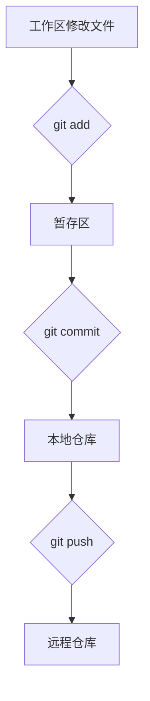
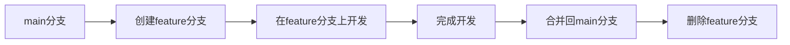

# Git 学习笔记

这是一个系统学习 Git 的笔记，重点在于命令使用和工作流程。

## 基础概念

Git 是一个分布式版本控制系统，核心概念包括：

- **工作区 (Working Directory)**：实际编辑文件的地方
- **暂存区 (Staging Area)**：临时存放待提交文件的地方
- **本地仓库 (Local Repository)**：存储提交历史的地方
- **远程仓库 (Remote Repository)**：托管在服务器上的仓库

> [!tip] 核心概念
> Git 的三个区域概念是理解其工作流程的关键

## 常用命令

### 初始化和配置

```bash
# 初始化仓库
git init

# 配置用户信息
git config --global user.name "Your Name"
git config --global user.email "your.email@example.com"

# 查看配置
git config --list
```

### 基础操作

```bash
# 查看状态
git status

# 添加文件到暂存区
git add <file> # 添加指定文件
git add . # 添加所有文件
git add -u # 添加已修改和删除的文件（不包括新文件）

# 提交更改
git commit -m "提交信息"
git commit -a -m "提交信息" # 跳过暂存区，直接提交已跟踪文件

# 查看提交历史
git log
git log --oneline # 简洁格式
git log --graph # 图形化显示分支
```

### 分支管理

```bash
# 查看分支
git branch

# 创建分支
git branch <branch-name>

# 切换分支
git checkout <branch-name>
git switch <branch-name> # 新版本推荐

# 创建并切换分支
git checkout -b <branch-name>
git switch -c <branch-name>

# 合并分支
git merge <branch-name>

# 删除分支
git branch -d <branch-name> # 删除已合并的分支
git branch -D <branch-name> # 强制删除分支
```

### 远程操作

```bash
# 添加远程仓库
git remote add origin <repository-url>

# 查看远程仓库
git remote -v

# 拉取代码
git fetch # 只获取不合并
git pull # 获取并合并
git pull origin <branch> # 指定分支

# 推送代码
git push origin <branch>
git push -u origin <branch> # 第一次推送并设置上游分支
```

### 撤销和修改

```bash
# 撤销暂存区的文件
git restore --staged <file>

# 撤销工作区的修改
git restore <file>

# 修改最后一次提交
git commit --amend

# 回退到之前的版本
git reset --hard <commit-hash> # 彻底回退（慎用）
git reset --mixed <commit-hash> # 默认模式，保留工作区修改
git reset --soft <commit-hash> # 只移动HEAD，保留暂存区和工作区
```

### 标签管理

```bash
# 创建标签
git tag <tag-name> # 轻量标签
git tag -a <tag-name> -m "信息" # 注释标签

# 查看标签
git tag

# 推送标签
git push origin <tag-name>
git push origin --tags # 推送所有标签

# 删除标签
git tag -d <tag-name>
git push origin --delete <tag-name>
```

## 常用工作流程

### 基础工作流程



### 特性分支工作流程



## 常见问题处理

> [!warning] 警告
> 以下操作可能导致数据丢失，请谨慎使用

### 合并冲突解决

1. 手动编辑冲突文件，选择保留哪些内容
2. 标记冲突已解决：`git add <file>`
3. 继续合并：`git commit`

### 丢失的提交恢复

```bash
# 查看所有操作历史（包括已删除的）
git reflog

# 恢复到特定状态
git reset --hard HEAD@{n}
```

## 最佳实践

> [!success] 良好习惯
> 良好的 Git 使用习惯

1. **频繁提交**：保持提交粒度小，每次提交只做一件事
2. **有意义的提交信息**：使用祈使句，清晰描述变化
3. **及时拉取**：在开始工作前先拉取最新代码
4. **使用分支**：为每个功能或错误修复创建独立分支
5. **代码审查**：通过 pull request 进行代码审查

## 参考资源

- [[Git官方文档]]
- [[Pro Git书籍]]
- [[GitHub帮助文档]]

> [!info] 更新信息
> 最后更新：2026-04-12
> 此笔记将持续更新，欢迎补充完善
> 该笔记由 AI 生成，请注意鉴别
